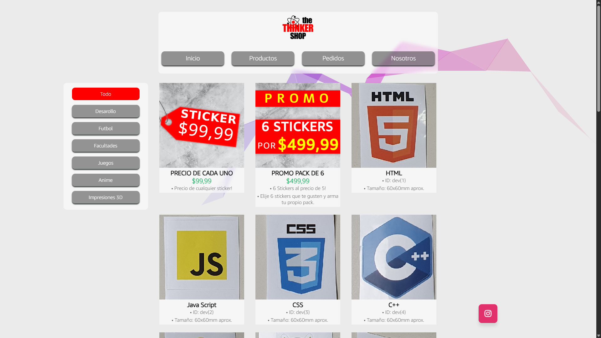

# 📌 Sitio web expositor de productos para un negocio.

---

## 📝 Descripción
Sitio web que desarrollé para un microemprendimiento personal de venta de stickers, sumada la finalidad de aprender.  
El mismo presenta un formato simple y estático client-side, es decir, sin utilización de back end ni uso de apis externas.

---

## 🛠 Tecnologías Utilizadas
- Lenguajes: **HTML, CSS, JS**
- Librerías: **-**
- Herramientas: **VS code, github.**
